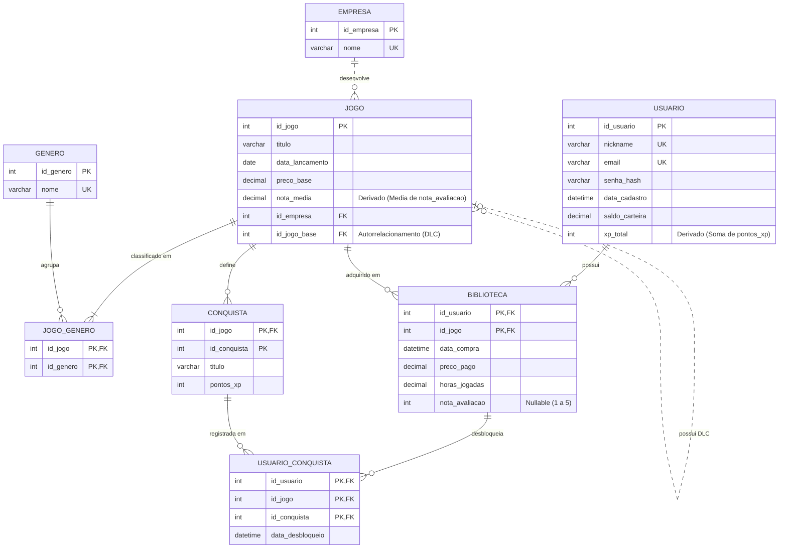

```mermaid

erDiagram
    USUARIO {
        int id_usuario PK
        varchar nickname UK
        varchar email UK
        varchar senha_hash
        datetime data_cadastro
        decimal saldo_carteira
        int xp_total "Derivado (Soma de pontos_xp)"
    }

    EMPRESA {
        int id_empresa PK
        varchar nome UK
    }

    JOGO {
        int id_jogo PK
        varchar titulo
        date data_lancamento
        decimal preco_base
        decimal nota_media "Derivado (Media de nota_avaliacao)"
        int id_empresa FK
        int id_jogo_base FK "Autorrelacionamento (DLC)"
    }

    GENERO {
        int id_genero PK
        varchar nome UK
    }

    JOGO_GENERO {
        int id_jogo PK, FK
        int id_genero PK, FK
    }

    CONQUISTA {
        int id_jogo PK, FK 
        int id_conquista PK 
        varchar titulo
        int pontos_xp
    }

    USUARIO_CONQUISTA {
        int id_usuario PK, FK
        int id_jogo PK, FK
        int id_conquista PK, FK
        datetime data_desbloqueio
    }

    BIBLIOTECA {
        int id_usuario PK, FK
        int id_jogo PK, FK
        datetime data_compra
        decimal preco_pago
        decimal horas_jogadas
        int nota_avaliacao "Nullable (1 a 5)"
    }

    %% Relacionamentos Não-Identificadores
    EMPRESA ||..o{ JOGO : "desenvolve"
    JOGO |o..o{ JOGO : "possui DLC"

    %% Relacionamentos Identificadores
    JOGO ||--o{ CONQUISTA : "define"
    JOGO ||--|{ JOGO_GENERO : "classificado em"
    GENERO ||--o{ JOGO_GENERO : "agrupa"
    USUARIO ||--o{ BIBLIOTECA : "possui"
    JOGO ||--o{ BIBLIOTECA : "adquirido em"
    BIBLIOTECA ||--o{ USUARIO_CONQUISTA : "desbloqueia"
    CONQUISTA ||--o{ USUARIO_CONQUISTA : "registrada em"
```